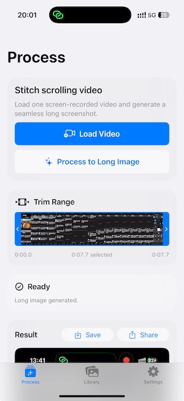

# ScrollSnap

## Project note

This project is an experiment in response to the “SaaSpocalypse” concern: the fear that AI may make prebuilt software obsolete by generating software on demand with minimal human skill.

It also explores whether an LLM can compress working software into a prompt and then restore the software by decoding that prompt.

Readers are invited to recreate this app using the prompt included in this README.

## App purpose

ScrollSnap is an iOS utility that turns a scrolling screen recording into one long screenshot.

## Features

- Import one video from Photos
- Trim start/end range before processing
- Automatically stitch scrolling content into a long image
- Save manually to Photos or share
- Keep an in-app library of generated images

## Download

ScrollSnap is available on the App Store: [https://apps.apple.com/app/id6759849068](https://apps.apple.com/app/id6759849068)

## "Prompt as a Software" or "Prompt as a Service"

You are rebuilding an iOS app named ScrollSnap (iOS 18+), using SwiftUI, AVFoundation, PhotosUI, and UIKit interop where needed.

Goal:
Build a focused utility that converts a scrolling screen recording into one seamless long screenshot with minimal user effort. UX should feel modern, polished, and fast, while staying simple and “use-and-forget.”

Product principles:
1) Single primary job: video -> long image.
2) Minimal taps and clear status.
3) Keep generated results in-app (library).
4) User-controlled export (save/share), never forced.
5) Native iOS patterns, light/dark mode, no visual clutter.

### App structure

Create a 3-tab app with NavigationStack per tab:

Tab 1: “Process” (system image: sparkles.rectangle.stack)
Tab 2: “Library” (photo.on.rectangle.angled)
Tab 3: “Settings” (gearshape)

Global environment objects:
- LibraryStore (generated image persistence)

### Process tab (primary flow)

Top-level flow:
1) User taps “Load Video” (PhotosPicker, videos only).
2) App imports selected video into temp URL.
3) App shows trim timeline card (if a video is loaded).
4) User taps “Process to Long Image”.
5) App runs optional scroll-confidence check.
6) If uncertain/not scrolling: show alert “Not a Scrolling Video?” with:
   - Process Anyway
   - Cancel
7) Stitching runs with progress.
8) On success:
   - Save generated image to local library store
   - Show result preview card
   - Show Save + Share actions
   - Show small hint text about slower scroll + trim if artifacts
9) On failure:
   - Show error alert
   - Status message suggests slower, steady recording

Header card:
- Title: “Stitch scrolling video”
- Subtitle: “Load one screen-recorded video and generate a seamless long screenshot.”
- Buttons:
  - “Load Video” (prominent)
  - “Process to Long Image” (disabled if no video or currently processing)

State card:
- Shows Ready/Processing status label
- Percent text while processing
- ProgressView while processing
- Status copy transitions:
  - “Extracting frames…” at start
  - During progress < ~0.92: “Aligning frames…”
  - Near completion: “Compositing final image…”
  - Success: “Long image generated.”
  - Save success: “Saved to Photos.”
  - Cancelled: “Processing cancelled.”

Trim timeline card:
- Appears only when video selected.
- Displays:
  - Filmstrip thumbnails (~20 frames)
  - Left/right draggable trim handles (“ears”) in blue
  - Dimmed out-of-range areas
  - Selected top/bottom borders in blue
  - Time labels: start, selected duration, end
- Handle behavior:
  - Enforce minimum gap (>= 0.5s or equivalent pixel gap)
  - Dragging left updates trimStart
  - Dragging right updates trimEnd
- Popup preview:
  - While dragging each handle, show floating thumbnail above strip.
  - Popup uses source aspect ratio with max size constraints.
- Timeline feeds stitch range:
  - stitch(videoURL, startTime: trimStart, endTime: trimEnd)

Result card:
- Title: “Result”
- Shows generated image scaled to fit with rounded corners.
- Action buttons:
  - Save (manual save to Photos)
  - Share (ShareLink)
- Sticky actions:
  - When result card scrolls offscreen, pin Save/Share in top safe-area capsule.
  - Use hysteresis thresholds to reduce flicker.

Alerts/sheets:
- Processing error alert title: “Couldn’t Process Video”
- Scroll warning alert title: “Not a Scrolling Video?”
- One-time support prompt sheet after first successful stitch (AppStorage flag):
  - “Enjoying ScrollSnap?”
  - Primary CTA: Rate
  - Secondary tip buttons (if products loaded)
  - “Maybe Later”

Lifecycle:
- Cancel processing task on view disappear.
- Cancel filmstrip loading task on disappear/video change.
- Reset prior result when new video selected.

### Video stitching engine (VideoStitchingService actor)

Public API surface:
- detectScrollingVideo(videoURL) async -> ScrollConfidence
- extractFramePairWithOverlap(videoURL, positionFraction, offsetSeconds) async throws -> UIImage
- stitch(videoURL, startTime, endTime, progress) async throws -> UIImage

Errors:
- noVideoTrack
- noFramesExtracted
- renderFailed

Current intended behavior:
- detectScrollingVideo currently returns confident by default (simple implementation acceptable, keep API ready for smarter detection).
- extractFramePairWithOverlap creates a side-by-side debug visualization of two frames with overlap annotations.
- stitch performs actual long-image creation.

Stitch algorithm requirements (recreate practical behavior, not over-research):
1) Load video track and duration; validate non-empty range.
2) Decode frames sequentially with small fixed spacing (~0.1s).
3) Use normalized cross-correlation in grayscale between:
   - Reference template band centered vertically (approx 600px band, half-height 300)
   - Search region in upper portion of next frame
4) Compute vertical shift from best match.
5) Accept/reject pair heuristics:
   - Reject low confidence (e.g., NCC < ~0.8)
   - Reject unrealistic huge shift
   - Skip tiny shift (< ~10px) to avoid duplicates
6) For accepted pairs:
   - Append only newly revealed lower strip from next frame
   - Keep continuity so later content appears below earlier content
7) Add final tail strip from latest frame.
8) Composite all strips top-to-bottom into one tall UIImage.
9) Report progress from early extraction to final render, finish at 1.0.

Scrollbar removal (important):
- Detect right-edge scrollbar x-position lazily using temporal variance across seam pair columns.
- If detected:
  - Back-patch first slice
  - Remove scrollbar on each committed slice by extending left neighbor pixel into scrollbar columns.
- Apply per-slice at commit time, not whole-image post-process.

Performance/robustness:
- Use async AVAssetImageGenerator image(at:) calls.
- Gracefully stop if decode fails near tail.
- Throw meaningful LocalizedError descriptions.
- Actor-isolated and cancellation-aware.

### Data models & storage

GeneratedImageItem:
- id: UUID
- createdAt: Date
- imageFilename: String
- width: Int
- height: Int
- sequenceNumber: Int (persistent, never reused)

Display naming:
- displayName = “Image %03d”
- Stable per item forever.

LibraryStore (MainActor ObservableObject):
- Stores images under Documents/Generated/
- Maintains index file generated-index.json
- addImage(image) writes JPEG (quality ~0.95), inserts newest first
- delete(item) removes file + index entry
- clearAll() removes all generated images
- migration:
  - For legacy items with sequenceNumber == 0, assign numbers oldest-first
- nextSequenceNumber persisted in UserDefaults and only increments
- usedStorageText computed from file sizes with ByteCountFormatter

### Library tab

If empty:
- ContentUnavailableView “No Snapshots Yet”

If not empty:
- 2-column fixed grid
- Card per image:
  - fixed-height thumbnail area (160pt), clipped
  - displayName
  - relative date text
- Tap card -> detail view

Detail view:
- Large image preview
- Top-right Share button
- Top-right Menu button with:
  - Save to Photos
  - Delete (destructive + confirm dialog)
- Missing item fallback view: “Snapshot Missing”

Share behavior:
- Export using temp file named with displayName + .jpg
- Use ShareLink previews.

### Settings tab

Form sections:
1) Storage
2) Legal

Storage section:
- “Used Space” from LibraryStore.usedStorageText
- “Clear Library” destructive with confirmation dialog

Legal section:
- External links:
  - Terms of Service URL
  - Privacy Policy URL

No extra settings clutter.

### Media & permissions

Video import:
- PhotosPicker videos only.
- Copy imported file to temp URL via Transferable type.

Save to Photos:
- Request add-only photo permission.
- Save image URL to Photos using PHPhotoLibrary performChanges.
- Handle permission denied and save failure with user-friendly errors.

### Design language

- Native SwiftUI materials and grouped backgrounds.
- Rounded cards (soft corners, modern iOS look).
- No custom design system; use system typography/colors.
- Support both dark and light mode via system defaults.
- Keep hierarchy clean, sparse, and practical.

Do NOT add:
- login/accounts
- cloud sync
- social feed
- advanced editing suites
- extra tabs/pages
- noisy animations

### Non-functional requirements

- iOS 18.0+
- Swift Concurrency best practices
- Clear cancellation behavior
- Solid empty states and error alerts
- No forced auto-save to Photos
- Manual save/share only
- Keep app responsive while processing.

### Deliverables

Implement:
1) Full SwiftUI app with the exact 3-tab UX above.
2) Working local persistence for generated images + metadata.
3) Working stitching engine with practical, deterministic seam logic.

Provide:
- Buildable Xcode project structure.